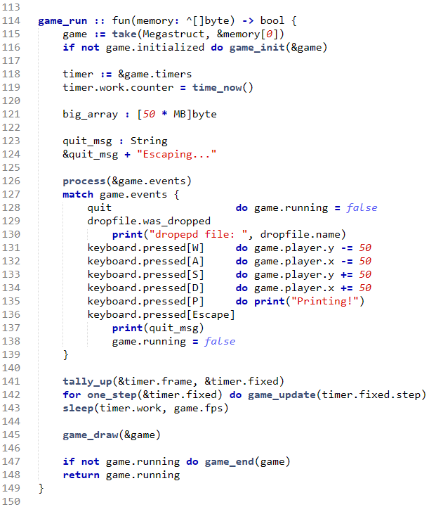
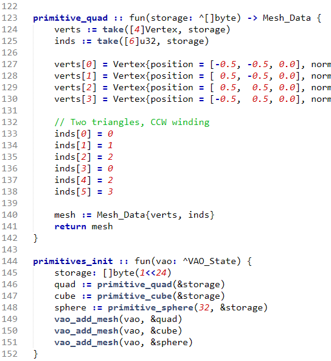

# Mara

Is a vibe-coded programming language. Directed by me, and written by Claude Opus 4.6 and 4.7. Mara's birthday is 3 Feb 2026.

## What it looks like

Hello world looks like this

```mara
module hello

main :: fun() {
    print("Hello there!")
}
```

And real code looks like that



Main feature of Mara is stack-like memory allocation. Everything in Mara lives until the end of scope. You can get data out of functions by returning it, or by passing in a block of memory and writing to it.



## Building the compiler

The Mara compiler is written in [Odin](https://odin-lang.org/). To rebuild
it from source you need Odin on PATH; everything else (clang, lld) ships in
[`tools/`](tools/).

```
odin build .
```

Windows only. Linux version coming soon. Codebase should be cross platform already, but haven't tested yet.

## Using Mara

Go to the folder where you have your Mara source code and type

```
mara build <module-name>
```

If you don't pass a module name, Mara infers it from the current folder's
name. My typical workflow is:

```
cd C:\Code\Mara\Pounce
mara build
```

## Project layout

Mara std lib is in the code folder. We don't have much at the moment. We do have some partial SDL bindings.

If you want example code, look in the Pounce folder. It's an empty open_gl project. Opens a window, draws a square, takes input.

## License

See [LICENSE](LICENSE).
