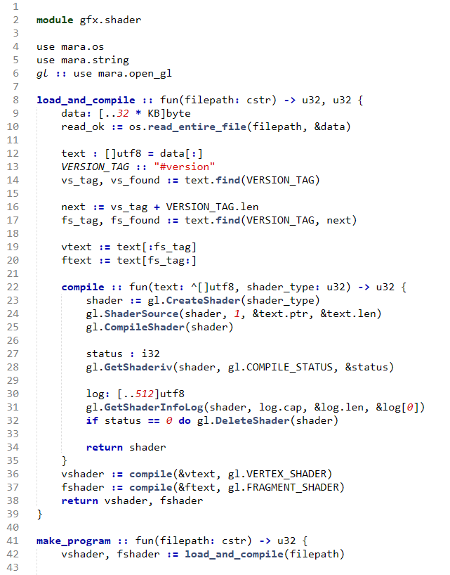
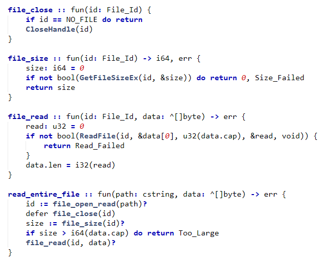

# Mara

Is a vibe-coded programming language. Directed by me, and written by Claude Opus 4.6 and 4.7. Mara's birthday is 3 Feb 2026.

## What it looks like

Hello world looks like this

```mara
module hello

main :: fun() {
    print("Hello there!")
}
```

And real code looks like that



Main feature of Mara is stack-like memory allocation. Everything in Mara lives until the end of scope. You can get data out of functions by returning it, or by passing in a block of memory and writing to it.

NEW! Mara now has error handling! Define an error enum, and return it when you have an error. If you're calling a function that can error, just slap a question mark on it and you're good to go. You can check the error value if you want, or you can print it, and you'll see the first error that occured.



## Building the compiler

The Mara compiler is written in [Odin](https://odin-lang.org/). You need
Odin on PATH to compile it. From the repo root:

```
odin build .
```

Mara uses clang and lld to build it's executables. For the windows build, I placed these in the tools folder so you don't have to download LLVM. For the linux build, I recommend you download them via the package manager.

I also recommend grabbing SDL3-devel if you want to build the test project.

## Using Mara

Go to the folder where you have your Mara source code and type

```
mara build <module-name>
```

If you don't pass a module name, Mara infers it from the current folder's
name. My typical workflow is:

```
cd C:\Code\Mara\Pounce
mara build
```

## Project layout

Mara std lib is in the code folder. We don't have much at the moment. We do have some partial SDL bindings.

If you want example code, look in the Pounce folder. It's an empty open_gl project. Opens a window, draws a square, takes input.

## License

See [LICENSE](LICENSE).
